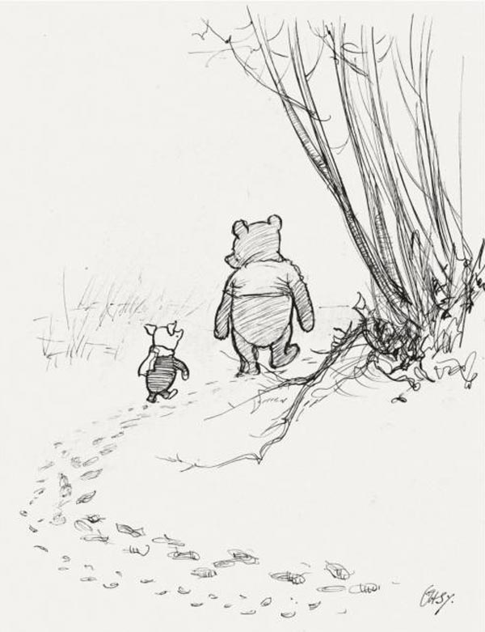
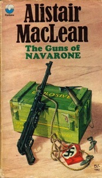
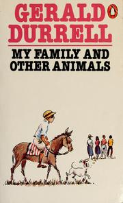

# On Books

As a young boy, I had a strange, electric relationship with my books. 

In which Pooh and Piglet go hunting and nearly catch a Woozle

Not all of them—no, certainly not. Some of them do occupy spaces in the innermost recesses of my mind, and are still capable of triggering the strongest and most irrational of emotions. So while I cared nothing for a large (an impossibly large, so large that it was bigger than me when I first read it) illustrated copy of *Robin Hood*, I was—and am—irreversibly attached to a hard bound copy of *The Complete Winne-the-Pooh*, the one with the illustrations by E. H. Shepard. I was so attached to it that for several months, it came with me to breakfast, and conducted itself with courage and dignity, surviving numerous drops, spills and submersions in warm milk. It still carries a red badge of courage, from a bottle of otherwise perfectly good preserve, staining several dozen pages with abstract Rorschach patterns. 

<em>The guns of Navarone</em> drove me to a stratovolcano called Cotopaxi. Read about it <a href = "../../photography/cotopaxi/">here</a>.

For many years, Winnie-the-Pooh was relegated to the bookshelf, while I attached myself, serially, to second-hand copies of a great number of books. The second-hand books were old and tattered, bought off the streets for small sums of money. Most of the books I read then were second hand, or hand-me-downs, or books borrowed from musty libraries, as money was scarce and it was rightly concluded that several second hand books were more edifying than a single new one. When I finally grew into a person whose egoistic and intellectual thirst required—and whose income allowed—the purchase of new books, I realised with a pang that the second hand books were much better. My copy of Alistair MacLean’s *The Guns of Navarone* was once repaired by some unknown reader with clear tape. It’s so old—and used—that the tape has long since disappeared, leaving only pale rectangles to indicate its transient, translucent existence. The pages are all separate now, making it a pleasure to read, if not to hold. When I went to stay with my aunt for a few days, I asked for a book to read. She gave me a shiny new book, by Roald Dahl, with a gummed spine, that required you to force it open if you wanted the text near the spine to be flat. I did so, with some unhappiness, but not as much as my aunt expressed when she saw that the book now showed signs of wear. 

There’s only one joy as good as switching on a reading lamp, settling down in one’s chair and opening a much-loved book, fingers tingling with the anticipation of the effortless magic that the black text on yellow paper plays on your mind, transporting you fluently into another universe, that is now warm and welcoming with frequent custom. And that joy is the small, uncertain steps one takes when reading a new book—a new *one of those*—one of those that one remembers forever, that changes one forever. At first, one in unsure of what to expect, of what it is about. The construction of a new reality is always difficult, but the spadework a writer puts in the beginning usually pays back several fold with careful handling. Soon, one is entranced: an entirely new, completely different universe has just taken shape around one, where the stars shine with a distinctly new glow, and where one looks up, with wonder. 

Living in a gray world within gray walls, listening to gray words uttered in an endless litany at school, I found Beauty in my books. Each tattered volume was a flawless gem, a distillation of the emotion aroused by infinitely complex patterns of light and sound. Unlike a diamond, my books were living: each had a beginning and an end, each was driven by a powerful flow indistinguishable from time. Some stand out, like a book by Giovanni Guareschi that I don’t have the wrapper of, and still don’t know the name of. Of those early books, much of the factual engram has faded, leaving the cloak of emotion it was wrapped in to flutter down on little details, woodcuts, illustrations, irregularities in paper, the shape of the book…

My copy of Gerald Durrell’s *My family and Other Animals* reminds me of its past owner, an assiduous reader, who had underlined every alternate word and had scrawled synonyms in pencil in the margins. For several years, that was my thesaurus. A whole slew of books evokes no declarative memory but a vague, generic image of yellow, stained, paperback, but is bound to a strong emotional recollection.

As is it is often the case, I found it increasingly difficult to separate the real from the written. I started—unconsciously at first, then deliberately—to speak like the way people I had met in my books spoke. Events unfolded in reality that I had already witnessed in Linotype. I was moved by the force of destiny that propelled heroes to fame and others to tragedy, troubled by the fickleness writers displayed in treating their characters: like they were puppets. Finding the uncaring randomness of the world shaping even my life, I sought to regain control—if not in this world—then in mine. 

Like all good things, I realised with sudden panic that something had changed, that something had ended. Books no longer have the power to dissolve the hard walls around me, no longer can they repaint the sky lapis-lazuli and connect my pulse to that of the protagonist. Looking into a mirror one sunny winter morning, I realised it had been months since I had read a book. 

The real tragedy wasn’t that infrequent reading had made me so cold and cynical that I had lost the faculty to believe, to immerse myself totally in alternate realities. No, the real tragedy was that it was the other way around. 

The last book I read with wonder was Gene Wolfe’s *The Fifth Head of Cerebrus*. (For sentimental reasons, I consider it sacrosanct to criticism.) The idea that one of the finest books—the story of how I learnt to read, and read—was now at an end, slowly suffused through my life. Like many wonderful books, my story has a beginning and has an end. 

Unlike all wonderful books, it can only be read once. 

Writing comes with a heavy price: one loses innocence. I had seen fantastic worlds and watched grand tales unfold, and now, having seen the process of creation, the magic had seeped out of it, making a conman of the wizard. Several extremely unpleasant people intruded into my life and taught me to read ‘critically’. They turned me into a machine that deconstructed text, counted commas and winced at clichés. I learnt how Lawrence Durrell also wrote a book about his family’s stay in Corfu. In Lawrence’s book, Gerald Durrell is entirely absent. In Gerald Durrell’s book, Lawrence’s wife—who was with them all the time—is never mentioned. 

The powerful flux of time hurtles us all through the leaves of our lives. When we start, we can’t read. We inevitably skip over the funny parts, regretting it when we arrive at the heavy chapters, and have no way to go ahead—or go back. There are pages where the letters are smudged, the text unclear, and where we are confused and indecisive. And from time to time, we come to blank pages, that we need to fill out ourselves if we are to get on with the story. And finally, there are times when the leaves turn yellow, when the changing of the seasons nudges us gently into the glyph-free winter of uninterrupted white, of ceasing to exist. When we come to the epilogue, when there is a great cold distance between the last full stop and the blurb on the dust jacket, we must wish, for lack of ultimate choice, that it was a good book, and look forward to reading it again. 