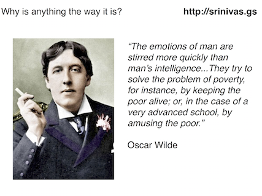
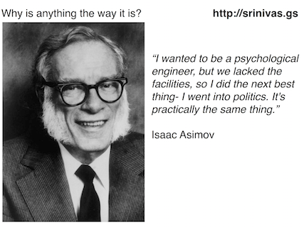

# Why is anything the way it is? 

</img>
  

So, why is anything the way it is?

Physicists ask why physical systems behave the way they do all the time. And when they do so, they figure out the constraints between structure and function of physical objects and of machines. We know why aeroplane wings have a certain shape because we understand Bernoulli's Principle. We know why most wires are made of copper because we understand the nature of conductivity in metals.

In these examples, we understood the fundamental scientific principle first, and then used our knowledge to build a new technology. Semiconductor physics led to microchips and computers; thermodynamics led to internal combustion engines and cars. Many objects around us came this way: we figured out something new in science, and a few decades (or sometimes a few centuries) later, we applied it to build new devices, new machines, new systems.

But there are some systems in our society that weren't built this way, but the other way around. They were constructed first, sometimes growing organically, and we then tried to understand how they worked, and tried to use science to figure out how they work. In many cases, we still haven't figured out how they work. And if think about this class of systems, the question of why things are the way they are takes on a different meaning. 

</img>
  

In this sense, many of our critical systems are not designed like we design cars or computers. Our political systems aren't this way because they are the optimal method of collective decision making and problem solving. Mostly, they are just outcomes of history, sometimes nothing more than the accumulation of hard-to-undo accidentals. Our economic systems aren't this way because we can know that our present levels of wealth distribution, employment and budgetary decisions are optimal, or even rational. We all know that they're far from that.

If you ask, "why is a car designed the way it is?" you will not get into trouble anywhere. But if you ask why the economy is the way it is, or why politics can only function in a certain way, it is very dangerous. I'm reminded of Helder Camara, who said that "When I give food to the poor, they call me a saint. When I ask why they are poor, they call me a communist".

</img>
  

We like to think we live in a intellectually free society, but in fact there are some questions that are frowned upon. You are allowed to take some, limited action that you will think will change the status quo, but if you question the status quo, you must be a dangerous revolutionary. Since 2008, we have been in a global stagnation of the world's financial and economic systems, together with an unprecedented move of wealth from the poor to the rich, and we still don't understand why it happened, and what we can do to prevent it in the future.

One of the reasons why states measure their citizens and their land is because they want to solve the problem of how to control all of us and get us to do what they want us to do. In an similar way, we cannot solve problems - mechanical, economic, political or social- if we don't know what's going on. If we don't understand how a machine works, we cannot fix it when it is broken, sometimes we cannot even tell when it is broken.  

</img>
  

Some of you may have heard Jacob Appelbaum and others urging you to use power for good, to do something to make the world suck less. That is true; but it is hard to debug code when you don't understand the language it was written in. Isaac Asimov, the science fiction writer, postulated in his "Foundation" trilogy that we will develop a science of how social systems work, and, in doing so, control its trajectory.

There is no reason why you and I can't figure out how economic and political systems work. There is no reason why we can't design these systems to work better, and to fix systematic bugs in these systems. In many ways, these systems are the biggest, most complicated machines we have ever built, and in the words of people who don't understand how this works, they're too big to fail. And they're too important to be left to economists and to politicians. 

